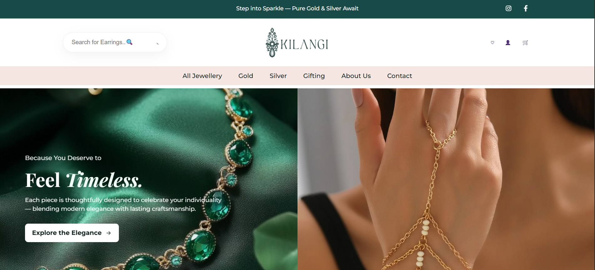

# Kilangi Jewellery Website

A beautiful and responsive e-commerce website for Kilangi Jewellery, showcasing timeless silver and gold jewellery with elegant designs and modern interactivity.

By: Stephanie Njonjo

## Description

Kilangi Jewellery is a premium e-commerce website that offers an elegant browsing experience for customers looking for high-quality silver and gold jewellery. The website features a modern design with smooth animations, interactive product displays, and intuitive navigation.

With Kilangi Jewellery, users can:

- Browse collections of rings, earrings, pendants, bracelets, and more
- View bestselling and recently viewed products
- Explore gift collections by price range and occasion
- Read customer testimonials and learn about the brand's ethos
- Experience smooth animations and interactive hover effects

## Screenshot


## Features

- **Responsive Design**: Works perfectly on all devices from desktop to mobile
- **Interactive Product Display**: Hover effects, animations, and smooth transitions
- **Category Filtering**: Filter products by jewellery type
- **Gift Collections**: Curated gift ideas for birthdays, anniversaries, and engagements
- **Customer Testimonials**: Social proof with customer reviews
- **Brand Story**: Learn about the brand's ethos and sustainability practices
- **Accessibility**: ARIA labels, semantic HTML, and keyboard navigation

## How to Use

### Requirements
- A modern web browser (Chrome, Firefox, Safari, Edge)
- Internet connection (for fonts and external images)

### View Live Site
Visit the live application at: 

### Local Development
If you want to run the project locally, follow these steps:

1. **Download the files** to your computer
2. **Open the project in VS Code**
3. **Open `index.html`** in your browser
   - Right-click the file and select "Open with Live Server" (if using VS Code Live Server extension)
   - Or simply double-click the file to open in your default browser

### File Structure
```
kilangi-jewellery/
├── index.html          # Main website file
├── styles.css          # All styling
├── main.js             # Interactive features
├── logo.png            # Main logo
├── footerlogo.png      # Footer logo
└── README.md           # This documentation
```

## Technologies Used

- **HTML5**: Semantic markup with accessibility features
- **CSS3**: Custom properties, Flexbox, Grid, and responsive design
- **JavaScript (ES6+)**: Interactive animations and features
- **Google Fonts**: Montserrat and Playfair Display

## Support and Contact

For any questions, suggestions, or assistance, feel free to reach out:
Email: stephnjonjo@gmail.com

## License

MIT License

Copyright © 2025 [Stephanie Njonjo]

Permission is hereby granted, free of charge, to any person obtaining a copy of this software and associated documentation files (the "Software"), to deal in the Software without restriction, including without limitation the rights to use, copy, modify, merge, publish, distribute, sublicense, and/or sell copies of the Software, and to permit persons to whom the Software is furnished to do so, subject to the following conditions:

The above copyright notice and this permission notice shall be included in all copies or substantial portions of the Software.

THE SOFTWARE IS PROVIDED "AS IS", WITHOUT WARRANTY OF ANY KIND, EXPRESS OR IMPLIED, INCLUDING BUT NOT LIMITED TO THE WARRANTIES OF MERCHANTABILITY, FITNESS FOR A PARTICULAR PURPOSE, AND NONINFRINGEMENT. IN NO EVENT SHALL THE AUTHORS OR COPYRIGHT HOLDERS BE LIABLE FOR ANY CLAIM, DAMAGES, OR OTHER LIABILITY, WHETHER IN AN ACTION OF CONTRACT, TORT, OR OTHERWISE, ARISING FROM, OUT OF, OR IN CONNECTION WITH THE SOFTWARE OR THE USE OR OTHER DEALINGS IN THE SOFTWARE.